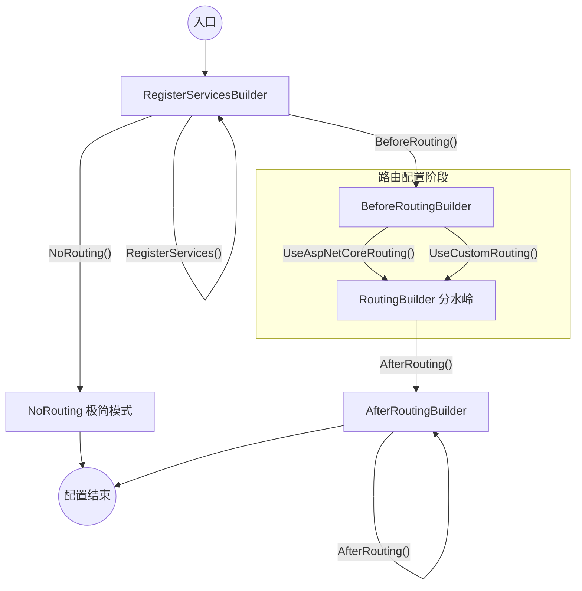

# TKWF.Domain.Web 配置教程

**一行配置 + 分阶段管道构建**（推荐模板）

本教程以 **AdminUI 项目** 为实际范本，分为 **WebAPI 项目**（采用 GraphQL + FastEndpoints）和 **Blazor Server 项目**（不采用 GraphQL、FastEndpoints）两大部分。

**核心理念**：通过 ConfigTkwDomain + 分阶段链式回调，让 Program.cs 极简、可读、可维护，同时严格保护领域自治。

---

### 1. 设计目标

- 领域层与表现层清晰分离
- 路由阶段显式、可控（自动或手动）
- 服务注册（IServiceCollection）与管道配置（IApplicationBuilder）彻底分离
- 异常捕获最前、路由后逻辑可控
- 未来扩展方便（Blazor WASM、MAUI、Worker 等）

---

### 2. 配置选项详解（DomainWebConfigurationOptions）

| 参数                           | 类型     | 默认值   | 作用与说明                                                   | 推荐场景            |
| ---------------------------- | ------ | ----- | ------------------------------------------------------- | --------------- |
| UseDomainExceptionMiddleware | bool   | true  | 是否启用框架统一的 JSON 异常响应中间件（生产环境强烈推荐）                        | 生产环境必须开启        |
| UseSessionUserMiddleware     | bool   | true  | 是否启用 SessionUserMiddleware（注入 DomainUser 到 HttpContext） | 几乎所有项目必须开启      |
| EnableDomainLogging          | bool   | false | 是否启用领域层 AOP 日志过滤器（记录方法调用、参数、耗时等）                        | 开发/调试时开启，生产关闭   |
| SuppressRoutingWarning       | bool   | false | 是否关闭“未选择路由阶段”的启动警告                                      | 特殊无路由项目可设为 true |
| IsDevelopment                | bool   | false | 传递开发环境标识给领域层（用于日志级别、异常工厂等守门员逻辑）                         | 必须设置            |
| ConnectionString             | string | ""    | 传递数据库连接字符串给领域层（FreeSql 等初始化依赖此值）                        | 必须设置            |

---

### 3. 管道阶段详解（最重要）

| 方法                         | 执行时机        | 典型用途                                             | 是否必须 | 备注         |
| -------------------------- | ----------- | ------------------------------------------------ | ---- | ---------- |
| .RegisterServices(...)     | 立即执行（容器构建期） | 注册 CORS、GraphQL、Blazor、AntDesign 等服务             | 推荐   | 服务注册必须在此阶段 |
| .BeforeRouting(...)        | 管道最前        | 异常页、CORS、HTTPS 重定向、静态文件等                         | 推荐   | 异常捕获必须最前   |
| .UseAspNetCoreRouting(...) | 路由分水岭       | 自动插入 app.UseRouting()，默认自动包含 UseAuthorization()。 | 二选一  | 最常用        |
| .UseCustomRouting(...)     | 路由分水岭       | 手动控制路由顺序                                         | 二选一  | 需要特殊顺序时使用  |
| .NoRouting(...)            | 路由分水岭       | 显式声明该项目不处理 Web 路由（如后台任务）。                        | 二选一  | 直接结束链式     |
| .AfterRouting(...)         | 路由之后        | 授权、端点映射、Blazor Hub、Fallback 等                    | 推荐   | 端点映射放这里    |

---




### 4. WebAPI 项目完整范本（采用 GraphQL + FastEndpoints）

```csharp
using DMP_Lite.Domain;
using DMP_Lite.WebApi.GraphQL;
using FastEndpoints;
using TKW.Framework.Domain.Web;

var builder = WebApplication.CreateBuilder(args);

// 1. 配置加载（严格优先级顺序）
builder.Configuration
    .AddJsonFile("appsettings.json", optional: true, reloadOnChange: true)
    .AddJsonFile($"appsettings.{builder.Environment.EnvironmentName}.json", optional: true, reloadOnChange: true)
    .AddUserSecrets<Program>()
    .AddEnvironmentVariables();

// 2. 领域层 + Web 管道配置（一行完成）
builder.ConfigTkwDomain<DmpUserInfo, DmpDomainInitializer>(cfg =>
{
    cfg.EnableDomainLogging = true;
    cfg.UseSessionUserMiddleware = true;      // 必须
    cfg.UseDomainExceptionMiddleware = true;  // 强烈推荐
    cfg.IsDevelopment = builder.Environment.IsDevelopment();
    cfg.ConnectionString = builder.Configuration
        .GetConnectionString("DefaultConnection") ?? string.Empty;
})
.RegisterServices((services, options) =>
{
    // 服务注册（必须在此阶段完成）
    services.AddCors(options =>
    {
        options.AddPolicy("DevelopmentPolicy", p => p.AllowAnyOrigin().AllowAnyHeader().AllowAnyMethod());
        options.AddPolicy("ProductionPolicy", p => p
            .WithOrigins("https://your-frontend-domain.com", "https://*.yourdomain.com")
            .AllowAnyHeader().AllowAnyMethod().AllowCredentials());
    });

    services.AddGraphQLServer()
        .AddQueryType<MerchantQuery>()
        .AddFiltering().AddSorting().AddProjections()
        .ModifyRequestOptions(opt => opt.IncludeExceptionDetails = options.IsDevelopment());

    services.AddFastEndpoints();
})
.BeforeRouting((app, options) =>
{
    if (options.IsDevelopment())
        app.UseDeveloperExceptionPage();

    var corsPolicy = options ? "DevelopmentPolicy" : "ProductionPolicy";
    app.UseCors(corsPolicy);
})
.UseAspNetCoreRouting()                    // 自动 UseRouting
.AfterRouting((app, options) =>
{
    app.UseAuthorization();
    app.MapGraphQL();
    app.UseFastEndpoints();                // FastEndpoints 端点映射
});

var app = builder.Build();
app.Run();
```

---

### 5. Blazor Server 项目完整范本（不采用 GraphQL、FastEndpoints）

```csharp
using DMP_Lite.Domain;
using TKW.Framework.Domain.Web;
using AntDesign.ProLayout;
using DMP_Lite.AdminUI.Services;
using Utils;

var builder = WebApplication.CreateBuilder(args);

// ───────────────────────────────────────────────────────────────
// 1. 配置加载（严格优先级顺序）
builder.Configuration
    .AddJsonFile("appsettings.json", optional: true, reloadOnChange: true)
    .AddJsonFile($"appsettings.{builder.Environment.EnvironmentName}.json", optional: true, reloadOnChange: true)
    .AddUserSecrets<Program>()
    .AddEnvironmentVariables();

// ───────────────────────────────────────────────────────────────
// 2. 领域层 + Web 管道配置（一行完成所有核心配置）
builder.ConfigTkwDomain<DmpUserInfo, DmpDomainInitializer>(cfg =>
{
    cfg.EnableDomainLogging = true;
    cfg.UseSessionUserMiddleware = true;      // 必须开启：注入 DomainUser
    cfg.UseDomainExceptionMiddleware = true;  // 生产环境统一 JSON 异常响应
    cfg.IsDevelopment = builder.Environment.IsDevelopment();
    cfg.ConnectionString = builder.Configuration
        .GetConnectionString("DefaultConnection") ?? string.Empty;
})
.RegisterServices((services, options) =>
{
    // Blazor Server + Ant Design + Razor Pages
    services.AddRazorPages();
    services.AddServerSideBlazor();
    services.AddAntDesign();

    // ProLayout 配置
    services.Configure<ProSettings>(builder.Configuration.GetSection("ProSettings"));

    // 本地化 + 交互字符串
    services.AddLocalization();
    services.AddInteractiveStringLocalizer();

    // 业务服务（Scoped，仅用于演示数据）
    services.AddScoped<IChartService, ChartService>();
    services.AddScoped<IProjectService, ProjectService>();
    services.AddScoped<IUserService, UserService>();
    services.AddScoped<IAccountService, AccountService>();
    services.AddScoped<IProfileService, ProfileService>();

    // CORS 策略（开发/生产分离）
    services.AddCors(options =>
    {
        options.AddPolicy("DevelopmentPolicy", p => p.AllowAnyOrigin().AllowAnyHeader().AllowAnyMethod());
        options.AddPolicy("ProductionPolicy", p => p
            .WithOrigins("https://your-frontend-domain.com", "https://*.yourdomain.com")
            .AllowAnyHeader().AllowAnyMethod().AllowCredentials());
    });
})
.BeforeRouting((app, options) =>
{
    // ── BeforeRouting：路由之前执行（最前阶段） ──
    // 开发环境异常页面（必须最前，捕获所有后续异常）
    if (options.IsDevelopment())
        app.UseDeveloperExceptionPage();
    else // 生产环境异常处理（页面重定向）
    {
        app.UseExceptionHandler("/Error");
        app.UseHsts(); // 默认 30 天 HSTS
    }

    // HTTPS 重定向（放在路由前更安全）
    app.UseHttpsRedirection();

    // 静态文件（放在路由前，避免路由拦截静态资源）
    app.UseStaticFiles();

    // CORS（必须在路由之前，处理 OPTIONS 预检请求）
    var corsPolicy = options.IsDevelopment() ? "DevelopmentPolicy" : "ProductionPolicy";
    app.UseCors(corsPolicy);
})
.UseAspNetCoreRouting() // 自动插入 app.UseRouting()
.AfterRouting((app, options) =>
{
    // ── AfterRouting：路由之后执行 ──
    // 授权（必须在端点映射之前）
    app.UseAuthorization();

    // Blazor Server 路由（固定写法，放在最后）
    app.MapBlazorHub();
    app.MapFallbackToPage("/_Host");

    // 首次请求追踪（放在最后，确保捕获所有请求）
    app.UseFirstRequestTrackerAsync(removeAfterCapture: true);
});

// ───────────────────────────────────────────────────────────────
// 3. 构建并启动应用
// ───────────────────────────────────────────────────────────────
// 注意：这里不再需要任何手动中间件注册，所有逻辑已迁移到分阶段回调中
var app = builder.Build();
app.Run();
```

---

### 6. 不同场景示范

**场景 1：完整 Blazor Server 项目（推荐）**

使用上面的 Blazor Server 范本即可。

**场景 2：纯 WebAPI 项目（GraphQL + FastEndpoints）**

使用上面的 WebAPI 范本。

**场景 3：自定义路由顺序**

```csharp
.UseCustomRouting((app, options) =>
{
    app.UseRouting();
    app.UseSomeCustomMiddleware();
    app.UseAuthorization();
})
.AfterRouting((app, options) => { ... });
```

**场景 4：生产环境最小配置**

```csharp
cfg.EnableDomainLogging = false;
cfg.SuppressRoutingWarning = true;
```

**场景 5：完全不使用路由（纯静态文件服务）**

```csharp
.RegisterServices((services, options) => { ... })
.NoRouting((app, options) => { ... });   // 直接结束链式
```

---

### 7. 最佳实践与注意事项

- **路由阶段必须显式选择**：不调用 UseAspNetCoreRouting()、UseCustomRouting() 或 NoRouting() 会触发警告。
- **CORS 必须在 BeforeRouting**：否则 OPTIONS 预检请求可能失败。
- **UseAuthorization() 必须在 AfterRouting**：因为它依赖路由信息。
- **服务注册只能在 RegisterServices**：不能放在管道回调中（时机不对）。
- **开发环境**：强烈建议开启 UseDeveloperExceptionPage()（放在 BeforeRouting 最前）。
- **生产环境**：关闭 EnableDomainLogging，开启 UseDomainExceptionMiddleware。
- **Blazor Server**：MapBlazorHub() 和 MapFallbackToPage("/_Host") 固定放在 .AfterRouting 末尾。
- **FastEndpoints**：services.AddFastEndpoints() 在 .RegisterServices，app.UseFastEndpoints() 在 .AfterRouting。
- **DomainOptions 传递**：领域层可在 OnPreInitialize 中对 cfg 进行守门员修正。

---

如果需要进一步调整（例如增加 Blazor WASM 示例、修改警告文案、或补充 OnPreInitialize 示例），随时告诉我。
