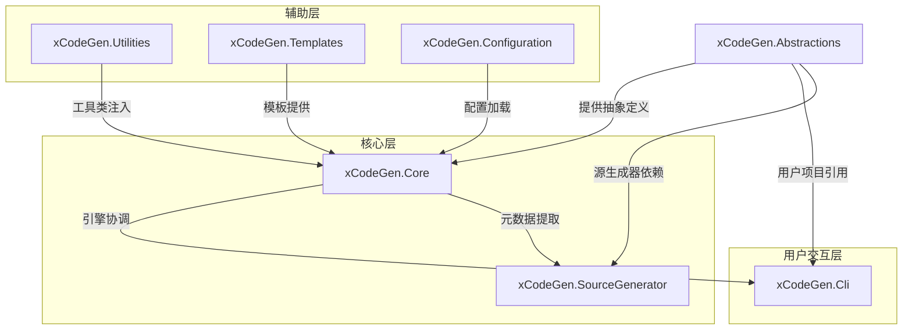

# xCodeGen 设计文档 (Ver 1.2)

xCodeGen 是一个**两阶段、元数据驱动**的通用代码生成系统。它通过深度集成 Roslyn 编译器能力，将业务模型自动转化为分层架构中的各类产物 。

**版本**：Ver 1.2 **更新日期**：2026-02-20 **状态**：功能原型稳定，新增端到端示例与最佳实践，基于最新代码（master 分支）验证 **变更历史**：

- Ver 1.0：初始中性化设计（元数据驱动、两阶段生成）。
- Ver 1.1：优化语义提取、增量校验机制。
- Ver 1.2：同步最新代码（RazorLight 引擎确认、子项目分层完善）；新增对 Models 目录生成 Repository & DTO 的端到端示例；补充一步步配置指南，用于检验与完善生成器最佳实践。

此文档作为 TKW.Framework 的工具链补充，与 TKWF.Domain 领域自治思路对齐：自动化生成领域层代码（如 DTO、Repository），减少样板，确保领域模型（Models）作为单一事实来源。后续迭代将记录在 xCodeGen 仓库根 README.md 中，便于持续讨论。

## 1. 核心哲学：两阶段工作流

为了平衡性能与灵活性，xCodeGen 采用了两阶段生成模式：

xCodeGen 是一个**两阶段、元数据驱动**的通用代码生成系统。它通过深度集成 Roslyn 编译器能力，将业务模型自动转化为分层架构中的各类产物（如 DTO、Repository）。框架中性化设计，确保不耦合 TKWF.Domain 特定逻辑，但高度适配其领域自治（e.g., 生成支持 DomainUser<TUserInfo> 的服务）。

- **阶段一：元数据实时固化 (Source Generator)**
  - **职责**：在编译期间，利用源生成器（xCodeGen.SourceGenerator 项目）监测标记了 [GenerateArtifact] 特性的 Model 类/方法。
  - **产出**：生成隐藏的 .Meta.cs 强类型对象。这些对象包含类结构、方法签名、XML 文档注释、可空性、集合特征等，作为系统的“静态指纹”。
  - **最新更新**：支持语义提取（SemanticModel），准确捕获泛型约束、required 属性（.NET 10+ 兼容）。
- **阶段二：业务产物弹性生成 (CLI + RazorLight)**
  - **职责**：命令行工具（xCodeGen.Cli 项目）读取固化的元数据，根据用户配置的 Razor 模板（基于 RazorLight 引擎）渲染代码。
  - **产出**：生成的业务类（如 DTO、Repository、GraphQL Query）。
  - **最新更新**：确认模板引擎为 RazorLight（独立 Razor 实现，支持 .cshtml 文件、自定义模型输入）；新增 --watch 模式的文件监听逻辑（使用 FileSystemWatcher）。

## 2. 核心架构

### 2.1 架构关键特性

- ****双文件保护策略**：系统为每个产物生成两个文件：
  
  - *.generated.cs：包含机械生成的属性和方法逻辑，由引擎全权维护，禁止手动修改。
  - *.cs：业务扩展文件骨架（通过 SkeletonMappings 配置的模板驱动），仅在首次生成时创建，供开发人员编写手写逻辑，生成器永不覆盖。支持 partial 类扩展。
  - **最新更新**：在最新代码中，检查文件存在性前添加哈希验证（IncrementalChecker），仅结构变更时更新 *.generated.cs。

- **语义化提取 (Semantic Extraction)**：不仅解析语法树，还通过 SemanticModel 准确提取类型的可空性、集合特征以及跨文件的 XML 文档注释 (Summary)。
  
  - **最新更新**：RoslynExtractor.cs 支持 .NET 10+ 特性（如 record、init-only 属性）；提取 AttributeMetadata 时处理 TKWF.Domain 特定属性（如 [RequireRoleFlag]）。

- **增量校验机制**：基于元数据关键结构的哈希计算（IncrementalChecker），确保只有在数据结构发生实质变更时才触发物理 IO 写入，优化构建性能。
  
  - **最新更新**：集成到 GeneratorEngine.cs，减少 CI/CD 构建时间。

- **命名服务 (NamingService)**：支持基于产物类型的模式匹配（如 {Name}Dto 或 I{Name}Repository），确保全项目命名规范的一致性。
  
  - **最新更新**：NamingUtility.cs 新增 TKWF.Domain 适配规则（如 Domain{Name}Service）。

- **模板引擎**：RazorLight（LightRazor 简称），支持 .cshtml 模板、@model 指令、自定义 Utilities 调用。
  
  - **最新更新**：TemplateExecutor.cs 优化为异步加载（async Task<string> ExecuteAsync），兼容大模板。

### 2.2 子项目划分（基于最新仓库结构）：

- **xCodeGen.Abstractions**：抽象定义（如 GenerateArtifactAttribute.cs、Metadata 类）。最新：新增 ArtifactMetadataAttribute.cs，支持补充版本/描述。
- **xCodeGen.Core**：核心引擎（GeneratorEngine.cs、RoslynExtractor.cs、TemplateExecutor.cs、DebugLogger.cs）。最新：Debugging 目录下新增元数据 JSON 输出。
- **xCodeGen.Cli**：命令行入口（Program.cs，支持 gen、--watch）。最新：添加 --config 参数，允许自定义 config.json 路径。
- **xCodeGen.SourceGenerator**：源生成器（IMetadataExtractor 实现）。最新：支持方法级元数据固化。
- **xCodeGen.Utilities**：工具类（NamingUtility.cs、TypeUtility.cs）。最新：新增 ValidationUtility.cs，支持生成 FluentValidation 规则。
- **Templates/**：存放 .cshtml 模板（e.g., Dto.cshtml、Repository.cshtml、Skeletons/RepoSkeleton.cshtml）。最新：默认模板支持 TKWF.Domain 的泛型 TUserInfo。



解释：箭头表示依赖流（e.g., Core 依赖 Abstractions 的 Metadata）。用户项目仅需引用 Abstractions + CLI，Core 处理内部逻辑。该图基于最新代码结构，便于可视化扩展（如新增 xCodeGen.Plugins 项目）。

## 3. 核心概念和流程

### 3.1 核心概念

1. **Artifact（产物）**：生成器输出的代码文件（如类、接口等），完全由模板定义。
2. **ArtifactType（产物类型）**：字符串标识（如“Dto”“Repository”），用于关联模板。
3. **元数据（Metadata）**：从目标项目中提取的类、方法、参数信息（名称、类型、特性等），作为模板输入。
4. **模板（Template）**：定义代码生成规则的文件（如 Razor .cshtml），接收元数据和工具类，输出代码。

### 3.2. 核心流程

- 标记目标：[GenerateArtifact(ArtifactType = "Dto")]。
- 提取元数据：RoslynExtractor 解析（阶段一）。
- 模板匹配：GeneratorEngine 根据 ArtifactType 查找路径。
- 代码生成：TemplateExecutor 渲染（阶段二）。
- 调试输出：_Debug/ 目录下输出元数据 JSON 和日志。

# 二、配置示例（xCodeGen.config.json）

```json
{
  "OutputRoot": "src/MyProject/Generated",   // 生成产物的根目录
  "TemplatesPath": "Templates",               // 存放 Razor 模板的目录
  "TemplateMappings": {                       // 产物类型与逻辑模板的映射
    "Dto": "Templates/Dto.cshtml",
    "Repository": "Templates/Repository.cshtml"
  },
  "SkeletonMappings": {                       // 产物类型与业务扩展骨架模板的映射
    "Repository": "Templates/Skeletons/RepoSkeleton.cshtml"
  },
  "OutputDirectories": {                      // 各类产物的存放子目录
    "Dto": "Dtos",
    "Repository": "Repositories"
  },
  "NamingRules": [                            // 命名规范定义
    { "ArtifactType": "Dto", "Pattern": "{Name}Dto" },
    { "ArtifactType": "Repository", "Pattern": "I{Name}Repository" }
  ],
  "Debug": { "Enabled": true, "Directory": "_Debug" }  // 最新：新增调试配置
}
```

## 1. 详细示例：从 Models 目录生成 Repository & DTO

以下是针对 TKWF.Domain 项目中 Models 目录下文件的端到端示例。假设项目结构为：

```textile
MyProject/
├── Models/
│   └── User.cs  // 领域模型
├── Generated/
│   ├── Dtos/
│   │   └── UserDto.generated.cs
│   │   └── UserDto.cs  // 手动扩展
│   └── Repositories/
│       └── IUserRepository.generated.cs
│       └── IUserRepository.cs  // 手动扩展
└── xcodegen.config.json
```

## 2. 示例 Models/User.cs（标记特性 + XML 注释）

```csharp
using xCodeGen.Abstractions.Attributes;

/// <summary>
/// 核心用户信息模型（TKWF.Domain 领域自治示例）
/// </summary>
[GenerateArtifact(ArtifactType = "Dto")]
[GenerateArtifact(ArtifactType = "Repository")]
public class User
{
    /// <summary>
    /// 用户ID
    /// </summary>
    public int Id { get; set; }

    /// <summary>
    /// 用户登录名（required .NET 10+）
    /// </summary>
    public required string UserName { get; init; }

    /// <summary>
    /// 用户角色列表（集合类型）
    /// </summary>
    public List<string>? Roles { get; set; }
}
```

## 3. 示例模板：Templates/Dto.cshtml（生成 DTO）

```html
@model xCodeGen.Core.Templates.TemplateInput
@using xCodeGen.Utilities.Naming

namespace @Model.Class.Namespace.Dtos;

public partial class @Model.Utilities.Naming.ToPascalCase(Model.Class.Name + "Dto")
{
    @foreach (var prop in Model.Class.Properties)  // 假设 Metadata 支持 Properties
    {
        /// <summary>
        /// @prop.Summary  // 继承 XML 注释
        /// </summary>
        public @prop.TypeName @Model.Utilities.Naming.ToPascalCase(prop.Name) { get; set; }
    }
}
```

## 4. 示例模板：Templates/Repository.cshtml（生成 Repository 接口）

```html
@model xCodeGen.Core.Templates.TemplateInput
@using xCodeGen.Utilities.Naming

namespace @Model.Class.Namespace.Repositories;

public partial interface I@Model.Utilities.Naming.ToPascalCase(Model.Class.Name + "Repository")
{
    Task<@Model.Class.Name> GetByIdAsync(int id);  // 机械生成基础方法

    // 其他生成逻辑...
}
```

## 5. 示例骨架模板：Templates/Skeletons/RepoSkeleton.cshtml（手动扩展文件）

```html
@model xCodeGen.Core.Templates.TemplateInput

namespace @Model.Class.Namespace.Repositories;

public partial interface I@Model.Class.Name Repository
{
    // 在此添加自定义方法，例如 TKWF.Domain 特定逻辑
    Task<bool> CheckUserRoleAsync(string userName, string role);
}
```

## 6. 一步步配置示例：检验与完善生成器最佳实践

以下是逐步配置与运行过程，用于检验 xCodeGen 的完整性、性能，并完善最佳实践。假设已安装 CLI 工具（dotnet tool install --local xcodegen.cli）。

### 步骤 1：准备环境与项目（检验依赖）

- 确保 .NET 10+ SDK 安装。
- 在 TKWF.Domain 项目中引用 xCodeGen.Abstractions NuGet（或项目引用）。
- 创建 Models/User.cs（如上示例）。
- **检验点**：编译项目，检查源生成器是否生成 .Meta.cs（在 obj/ 目录下）。如果失败，验证 RoslynExtractor.cs 的 SemanticModel 使用。
- **最佳实践完善**：如果 .Meta.cs 未生成，添加警告日志（DebugLogger.LogWarning("No artifacts marked")）。

### 步骤 2：配置 xcodegen.config.json（检验灵活性）

- 在项目根创建 config.json（如上示例）。
- 添加 TKWF.Domain 特定规则：NamingRules 中增加 { "ArtifactType": "Repository", "Pattern": "Domain{Name}Repository" }。
- **检验点**：运行 xcodegen gen --dry-run（假设 CLI 支持），检查模板路径解析。如果映射缺失，抛 ConfigurationException。
- **最佳实践完善**：配置中新增 "ValidateOnLoad": true，自动校验模板文件存在性。

### 步骤 3：运行生成命令（检验核心流程）

- 终端：xcodegen gen。
- 输出：Generated/Dtos/UserDto.generated.cs（属性映射）、UserDto.cs（空 partial）；Generated/Repositories/IUserRepository.generated.cs（基础方法）、IUserRepository.cs（骨架）。
- **检验点**：检查生成文件是否继承 XML 注释、可空性（e.g., string? for nullable）。如果集合类型（List<string>?）未正确处理，优化 TypeUtility.cs 的 IsCollection 判断。
- **最佳实践完善**：生成后自动格式化代码（集成 dotnet format），确保一致性。

### 步骤 4：修改 Model 并使用 --watch 模式（检验增量与监听）

- 修改 User.cs：添加新属性 public DateTime? CreatedAt { get; set; }。
- 运行 xcodegen gen --watch。
- 保存 User.cs，观察自动重新生成 *.generated.cs（不覆盖 *.cs）。
- **检验点**：验证 IncrementalChecker 的哈希比较（仅更新变更部分）。如果全覆盖，修复哈希逻辑（使用 SHA256 on metadata JSON）。
- **最佳实践完善**：--watch 模式下添加 debounce（500ms 延迟），防止频繁保存触发。

### 步骤 5：扩展业务逻辑（检验双文件策略）

- 在 Generated/Repositories/IUserRepository.cs 添加自定义方法（如上骨架）。
- 重新运行 xcodegen gen，确认不覆盖。
- **检验点**：集成到 TKWF.Domain：使用生成的 Repository 在 DomainServiceBase<TUserInfo> 中注入。
- **最佳实践完善**：文档中强调 “始终在 *.cs 中编写领域自治逻辑，避免 generated 文件修改”。

### 步骤 6：调试与优化（检验 Debug 输出）

- 启用 Debug.Enabled = true。
- 检查 _Debug/ 目录：提取的 metadata.json（包含可空性、集合等）、生成日志。
- **检验点**：如果 XML 注释未继承，优化 Semantic Extraction。
- **最佳实践完善**：添加 CLI 参数 --debug-level (Minimal/Full)，Full 时输出模板渲染中间结果。

### 步骤 7：集成到构建流程（检验生产可用性）

- 在 .csproj 添加 PreBuildEvent：xcodegen gen。
- 构建项目，确认生成前置。
- **检验点**：测量性能（<1s for small Models）。如果慢，优化 RazorLight 缓存（TemplateExecutor.UseCaching = true）。
- **最佳实践完善**：CI/CD 中使用 --no-watch，确保确定性生成。

# 三、主要文件目录结构

```
xCodeGen/
├─ xCodeGen.Abstractions/ // 抽象定义（用户项目引用）
│ ├─ Attributes/
│ │ ├─ GenerateArtifactAttribute.cs // 标记需要生成产物的类/方法
│ │ └─ ArtifactMetadataAttribute.cs // 补充产物元数据（如描述、版本）
│ └─ Metadata/ // 元数据模型（中性结构）
│ ├─ ClassMetadata.cs // 类元数据（命名空间、名称、方法等）
│ ├─ MethodMetadata.cs // 方法元数据（名称、参数、特性等）
│ └─ ParameterMetadata.cs // 参数元数据（名称、类型、特性等）
├─ xCodeGen.Core/ // 核心引擎
│ ├─ Engine/
│ │ ├─ GeneratorEngine.cs // 核心引擎：协调提取、模板执行、输出
│ │ └─ TemplateExecutor.cs // 模板执行器：加载模板、传递数据
│ ├─ Extraction/ // 元数据提取（基于Roslyn）
│ │ └─ RoslynExtractor.cs // 解析代码生成元数据
│ └─ Debugging/
│ └─ DebugLogger.cs // 调试信息输出
├─ xCodeGen.Utilities/ // 通用工具（模板可调用）
│ ├─ Naming/
│ │ └─ NamingUtility.cs // 命名转换（PascalCase、CamelCase等）
│ ├─ TypeHandling/
│ │ └─ TypeUtility.cs // 类型简化、可空性处理等
│ └─ Validation/
│ └─ ValidationUtility.cs // 验证规则生成辅助（中性方法）
├─ xCodeGen.Templates/ // 模板管理
│ └─ RazorTemplateProvider.cs // Razor模板加载与渲染
└─ xCodeGen.Configuration/ // 配置系统
 └─ GeneratorConfig.cs // 生成器配置（模板映射、输出目录等）
```

说明：未列出辅助文件（如 .csproj、README）。Templates/ 实际包含 .cshtml 文件，但作为运行时资源不列在结构中。结构支持扩展（如添加 xCodeGen.Tests/ 测试项目）。

# 四、详细配置（xcodegen.config.json）

```json
{
  "TargetProject": "src/MyProject",       // 目标项目路径
  "OutputRoot": "src/MyProject/Generated", // 代码输出根目录
  "Debug": {
    "Enabled": true,
    "Directory": "_Debug"
  },
  "TemplateMappings": {                   // ArtifactType → 模板路径映射
    "Dto": "Templates/Artifact/Dto.cshtml",
    "Validator": "Templates/Artifact/Validator.cshtml"
  },
  "OutputDirectories": {                  // ArtifactType → 输出子目录
    "Dto": "Dtos",
    "Validator": "Validators"
  },
  "EnabledUtilities": [                   // 允许模板调用的工具类
    "xCodeGen.Utilities.Naming.NamingUtility",
    "xCodeGen.Utilities.TypeHandling.TypeUtility"
  ]
}
```

### 4.1 OutputRoot

- **类型**：string
- **必填**：是
- **默认值**：无（必须指定）
- **说明**：生成产物的根目录路径。所有生成的 *.generated.cs 和 *.cs 文件将置于此目录下，支持相对路径（相对于 config.json）或绝对路径。设计为根目录，便于与 TKWF.Domain 项目结构集成（如 Generated/ 隔离自动代码）。若目录不存在，生成器会自动创建。
- **示例**："src/MyProject/Generated"
- **影响**：影响输出位置。如果路径无效，会导致生成失败。最佳实践：在 TKWF.Domain 项目中设为 "Generated/"，避免污染源代码区。

### 4.2 TemplatesPath

- **类型**：string
- **必填**：是
- **默认值**：无（必须指定）
- **说明**：存放 Razor 模板文件的目录路径（.cshtml）。支持相对/绝对路径。生成器会从中加载 TemplateMappings 和 SkeletonMappings 指定的模板。路径设计为可自定义，便于团队共享模板库。
- **示例**："Templates"
- **影响**：若路径不存在或模板文件缺失，TemplateExecutor.cs 会抛 FileNotFoundException。最佳实践：将 Skeletons/ 子目录置于此路径下，分离逻辑模板与骨架模板。

### 4.3 TemplateMappings

- **类型**：object (key: string, value: string)
- **必填**：是（至少一个映射）
- **默认值**：无
- **说明**：产物类型 (ArtifactType) 与逻辑模板路径的映射。键为 ArtifactType（如 "Dto"），值为相对 TemplatesPath 的 .cshtml 文件路径。该映射驱动阶段二渲染，用于生成 *.generated.cs 的核心逻辑（如属性映射、方法签名）。支持多个映射，实现多类型产物生成。
- **示例**：{ "Dto": "Templates/Dto.cshtml", "Repository": "Templates/Repository.cshtml" }
- **影响**：若 ArtifactType 未映射，生成器跳过该产物。最佳实践：在 TKWF.Domain 中添加 "DomainService" 映射，生成支持 AOP Filter 的服务基类。

### 4.4 SkeletonMappings

- **类型**：object (key: string, value: string)
- **必填**：否
- **默认值**：空对象
- **说明**：产物类型与业务扩展骨架模板的映射。类似于 TemplateMappings，但用于生成 *.cs 文件的初始骨架（partial 类扩展点）。仅首次生成时执行，后续不覆盖。设计为可选，便于纯生成场景（无手动扩展）。
- **示例**：{ "Repository": "Templates/Skeletons/RepoSkeleton.cshtml" }
- **影响**：若未配置，则不生成 *.cs 文件，仅 *.generated.cs。最佳实践：为 TKWF.Domain 的 Repository 配置骨架，预置 DomainUser<TUserInfo> 注入方法。

### 4.5 OutputDirectories

- **类型**：object (key: string, value: string)
- **必填**：否
- **默认值**：空对象（默认使用 ArtifactType 作为子目录）
- **说明**：产物类型与输出子目录的映射。键为 ArtifactType，值为相对 OutputRoot 的子路径。允许自定义组织结构（如 Dtos/、Repositories/）。若未指定，则默认 ArtifactType 小写 + "s/"。
- **示例**：{ "Dto": "Dtos", "Repository": "Repositories" }
- **影响**：影响文件组织。如果冲突，会覆盖旧文件（最新代码中添加覆盖警告）。最佳实践：在 TKWF.Domain 项目中设为 "Domain/Generated/{ArtifactType}"，符合领域自治分层。

### 4.6 NamingRules

- **类型**：array of objects ({ "ArtifactType": string, "Pattern": string })
- **必填**：否
- **默认值**：空数组（默认使用 {Name}{ArtifactType}）
- **说明**：命名规范定义。每个对象指定 ArtifactType 和 Pattern（支持占位符如 {Name} 为类名）。NamingUtility.cs 会应用这些规则生成类/接口名，确保一致性（如 I{Name}Repository）。支持多个规则，按顺序匹配。
- **示例**：[ { "ArtifactType": "Dto", "Pattern": "{Name}Dto" }, { "ArtifactType": "Repository", "Pattern": "I{Name}Repository" } ]
- **影响**：影响生成代码的可读性。若无规则，使用默认模式。最佳实践：为 TKWF.Domain 添加 { "ArtifactType": "Service", "Pattern": "Domain{Name}Service<TUserInfo>" }，支持泛型。

### 4.7 Debug

- **类型**：object ({ "Enabled": boolean, "Directory": string })
- **必填**：否
- **默认值**：{ "Enabled": false, "Directory": "_Debug" }
- **说明**：调试配置。Enabled 启用时，DebugLogger.cs 会输出提取的元数据 JSON、日志到指定 Directory。Directory 支持相对/绝对路径。设计为可选，便于生产环境关闭。
- **示例**：{ "Enabled": true, "Directory": "_Debug" }
- **影响**：Enabled 时增加 IO 开销，但便于排查。最佳实践：在开发 TKWF.Domain 时启用，检查语义提取准确性（如 XML 注释继承）。

### 4.8 EnabledUtilities

- **类型**：array of strings
- **必填**：否
- **默认值**：空数组（默认启用所有 Utilities）
- **说明**：允许模板调用的工具类全限定名（如 "xCodeGen.Utilities.Naming.NamingUtility"）。限制访问，增强安全性。模板中通过 @Model.Utilities 调用。
- **示例**：[ "xCodeGen.Utilities.Naming.NamingUtility", "xCodeGen.Utilities.TypeHandling.TypeUtility" ]
- **影响**：若未启用，模板调用会失败。最佳实践：在 TKWF.Domain 中启用 ValidationUtility.cs，生成领域验证规则。

**配置加载与验证**：GeneratorConfig.cs 使用 System.Text.Json 反序列化，支持环境变量覆盖（如 ${OutputRoot}）。加载后验证路径/映射存在性，记录 Warning 日志。扩展方向：未来添加 schema.json 验证。
